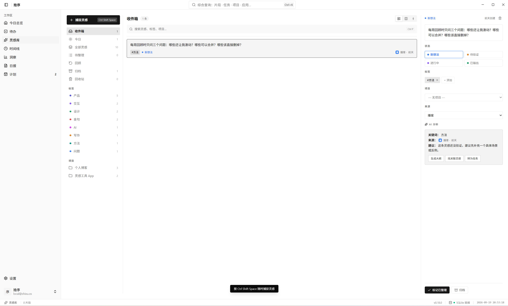
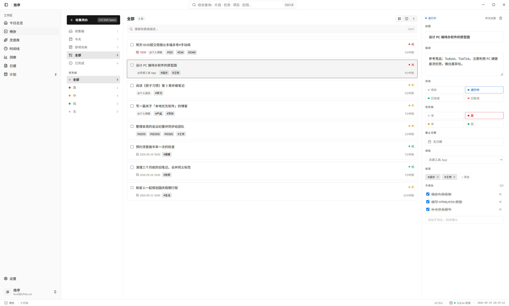
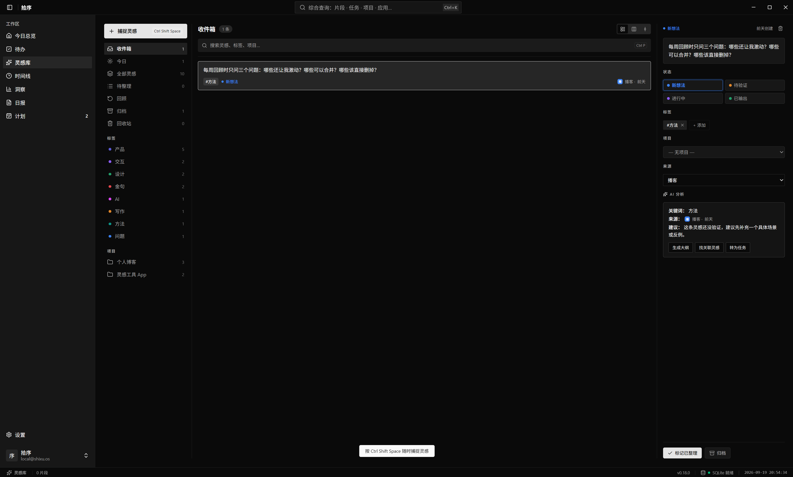
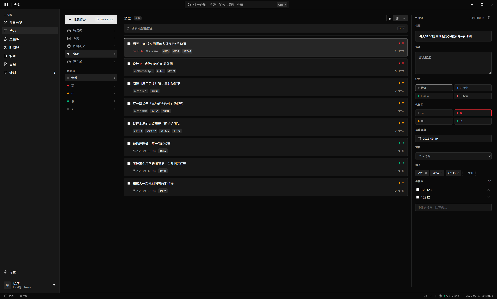
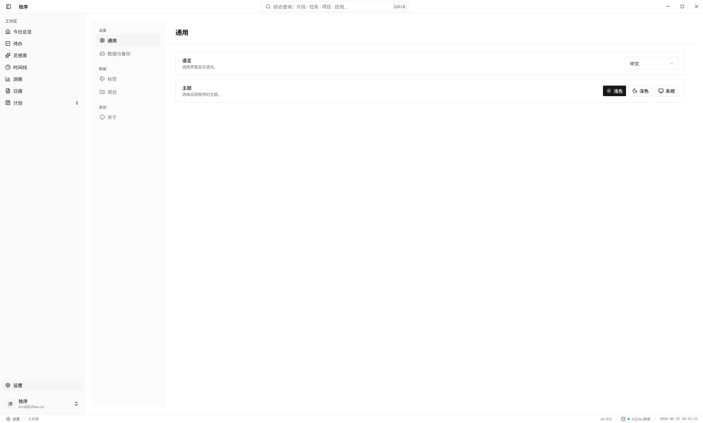
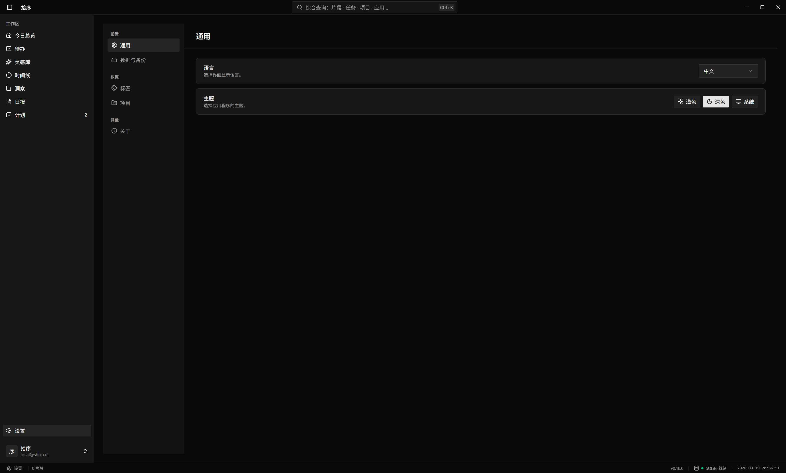

# 拾序 / SHIXU

一个会观察、会学习、会成长的个人 AI 操作系统——成为你数字世界里的长期伙伴，持续记忆、深度理解，并主动帮你优化每一天。

**Slogan**：从碎片到结构，AI 驱动你的全部工作。

|            |                                      |
| :--------- | :----------------------------------- |
| **中文名** | 拾序                                 |
| **英文名** | SHIXU                                |
| **定位**   | 面向个人知识工作者的 AI 工作操作系统 |
| **状态**   | MVP 开发阶段                         |

## 核心价值

- **少回忆**：自动记录当天做过的事，不再反复翻聊天、翻文档、翻浏览器历史。
- **好复盘**：用时间线、分类、热力图、应用统计，看清一天的投入分布。
- **快汇报**：基于真实记录生成日报，不再靠回忆编撰。
- **能进化**：从看见问题到主动提醒，AI 比你自己更懂你的计划。

## 四大原力

| 原力                  | 核心能力                                       | 用户价值                                     |
| :-------------------- | :--------------------------------------------- | :------------------------------------------- |
| **Memory（记忆）**    | 自动记录工作轨迹、项目历史、文件关系、知识碎片 | 「我以前做过什么？」「这个文件为什么重要？」 |
| **Context（上下文）** | 实时理解屏幕、应用、文档、浏览器、代码等活动   | 「用户正在开发 Tauri 项目」                  |
| **Insight（洞察）**   | 分析时间投入、工作模式、效率瓶颈、计划偏差     | 「你过去 7 天 35% 时间用于重复调试」         |
| **Action（行动）**    | AI Agent 主动提醒、建议时间安排、未来执行任务  | 「建议今天下午 4 点安排代码审查」            |

## 技术栈

- Rust
  - [Tauri v2](https://v2.tauri.app/start/) 作为桌面应用框架
  - [Tauri Store Plugin](https://v2.tauri.app/plugin/store/) 做持久化
  - [Tauri Log Plugin](https://v2.tauri.app/plugin/logging/) 做日志
  - [CrabNebula DevTools](https://v2.tauri.app/develop/debug/crabnebula-devtools/) 辅助开发调试

- Vue.js 3
  - [Shadcn Vue + Tailwind CSS v4](https://www.shadcn-vue.com/) 组件与样式
  - [Vue Router](https://router.vuejs.org/) 路由
  - [Vue I18n](https://vue-i18n.intlify.dev/) 国际化
  - [Pinia](https://pinia.vuejs.org/introduction.html) 状态管理

- AI Support
  - [Tauri Pilot](https://github.com/mpiton/tauri-pilot) 支持 AI Agent 实时检视、交互与调试 Tauri 应用

## Preview

### _Light mode dashboard view_




### _Dark mode settings view_




### _Language support view_




## Recommended IDE Setup

- [VS Code](https://code.visualstudio.com/) + [Volar](https://marketplace.visualstudio.com/items?itemName=Vue.volar) + [Tauri](https://marketplace.visualstudio.com/items?itemName=tauri-apps.tauri-vscode) + [rust-analyzer](https://marketplace.visualstudio.com/items?itemName=rust-lang.rust-analyzer)

## Prerequisites

按 [Tauri 环境准备指南](https://v2.tauri.app/start/prerequisites/) 配置开发环境。

## Installation

安装依赖：

```bash
pnpm install
```

## Development

桌面端开发：

```bash
pnpm tauri dev
```

### Internationalization (i18n)

[Vue I18n](https://vue-i18n.intlify.dev/)

#### Adding a new language

在 [locales](./src/i18n/locales/) 目录新建对应语言的 JSON 翻译文件（文件名即 locale）。

然后在 [lib/config.ts](./src/lib/config.ts) 的 `supportedLanguages` 中加入该语言。

### Helpful Tips

Tauri Store Plugin 会把 `settings.json` 存到：

**macOS**：`~/Library/Application Support/com.shixu.os`

#### App Icon

可用 Tauri CLI 的 [icon 命令](https://v2.tauri.app/reference/cli/#icon) 生成应用图标：

```bash
pnpm tauri icon <image-path>
```

## MVP 路线图

- **Phase 1**：自动记录窗口信息 + SQLite 存储 + 基础时间线 → Aha A（看清时间）
- **Phase 2**：活动分类 + 统计卡片 + AI 日报生成 → 自动复盘闭环
- **Phase 3**：任务创建 + 计划 vs 实际 + 主动提醒 → Aha C（被理解提醒）
- **后续**：录音转写、向量检索、团队协作

## Contributing

欢迎参与：

- 提交 Bug 或功能需求 Issue
- 提交改进 Pull Request
- 反馈现有功能
- 完善文档与翻译

## Deployment & Release

参考 [Tauri v2 Deployment Guide](https://v2.tauri.app/distribute/)。

构建二进制：

```bash
pnpm tauri build
```

合并到 `release` 分支时，仓库会通过 GitHub Actions 自动创建 Release。详见 [tauri-action](https://github.com/tauri-apps/tauri-action/tree/dev)。

### Caveats

若 macOS 使用 [signing identity](./src-tauri/tauri.macos.conf.json#L20) `-`，首次下载运行时需到「系统设置」→「隐私与安全性」允许应用运行。
参见 [tauri-apps/tauri-action/issues/824](https://github.com/tauri-apps/tauri-action/issues/824) 与 [Apple 支持文档](https://support.apple.com/guide/mac-help/open-a-mac-app-from-an-unidentified-developer-mh40616/mac)。
