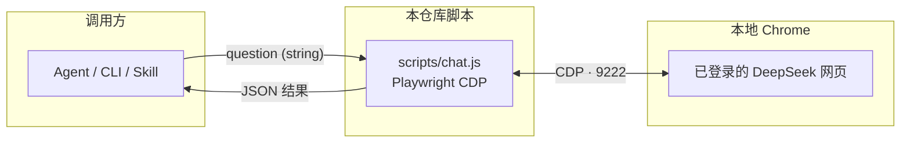

# deepseek-skills

[](https://github.com/ai-fzx/deepseek-skills)
[](./LICENSE)
[](https://nodejs.org/)
[](https://playwright.dev/)

| | |
| --- | --- |
| **仓库** | [github.com/ai-fzx/deepseek-skills](https://github.com/ai-fzx/deepseek-skills) |
| **问题反馈** | [Issues](https://github.com/ai-fzx/deepseek-skills/issues) |

---

## 新手必读

**本仓库是做什么的？** 通过 **Playwright 连接已登录的本地 Chrome**（CDP 协议），在 [DeepSeek 网页版](https://chat.deepseek.com) 自动提问、等待回复并返回结构化 JSON。适用于 **Agent / WorkBuddy / OpenClaw** 等需要调用 DeepSeek 能力且不走 API 的场景。

**一次登录，永久复用：** 首次在 Chrome 中手动登录 DeepSeek 后，后续所有调用自动复用该会话，无需反复登录。

**你需要先满足这三点：**

| 必须项 | 说明 |
| --- | --- |
| **① 安装 Node.js ≥ 18** | 运行脚本的基础环境。终端里执行 `node --version` 能输出版本号即可。 |
| **② 安装依赖** | 进入 `scripts/` 目录执行 `npm install`，会安装 Playwright 等依赖。 |
| **③ 首次登录 DeepSeek** | 以调试模式启动 Chrome（见下文），手动登录一次。**后续调用无需重复此步骤。** |

---

## 目录

- [新手必读](#新手必读) · [常见问题（FAQ）](#常见问题faq)
- [工作原理](#工作原理)
- [快速开始](#快速开始)
- [首次登录配置](#首次登录配置)
- [命令行使用](#命令行使用)
- [在 Agent / Skill 中调用](#在-agent--skill-中调用)
- [返回值格式](#返回值格式)
- [可选配置](#可选配置)
- [故障排查](#故障排查)
- [许可与贡献](#许可与贡献)
- [联系与作者](#联系与作者)

---

## 常见问题（FAQ）

**Q：不用 DeepSeek API，为什么走网页版？**  
网页版无需 API Key、无调用限额，且默认使用最新模型；适合对话式任务自动化场景。

**Q：每次调用都需要开着 Chrome 吗？**  
是的。需要保持 Chrome 以调试模式在后台运行（最小化即可），脚本通过 CDP 协议与其通信。

**Q：会不会影响我正常使用 Chrome？**  
调试模式的 Chrome 与普通窗口并存。建议使用独立的 `--user-data-dir` 目录（见配置说明）以隔离会话，不影响日常浏览。

**Q：每次提问都在同一个对话里吗？**  
默认每次调用会新建对话，避免历史消息干扰。如需在当前对话继续追问，传入 `--no-new-chat` 参数。

**Q：回复没有拿全怎么办？**  
默认超时 120 秒，通过 `options.timeout` 可调大。脚本会在文本连续稳定后才返回，一般足够等到完整回复。

---

## 工作原理



- **协议：** Playwright 通过 Chrome DevTools Protocol（CDP）控制本地浏览器，不经过中间代理。
- **输出：** CLI 始终输出 **纯 JSON**（stdout），日志与错误走 **stderr**，不污染结果。
- **完成检测：** 双重判断——停止生成按钮消失 + 回复文本连续两次稳定，确保拿到完整内容。

---

## 快速开始

```bash
# 1. 克隆仓库
git clone https://github.com/ai-fzx/deepseek-skills.git
cd deepseek-skills/scripts

# 2. 安装依赖
npm install

# 3. 安装 Playwright 浏览器（首次必做）
npx playwright install chromium
```

---

## 首次登录配置

### 方式 A：手动启动 Chrome（推荐）

```powershell
# Windows
Start-Process -FilePath "C:\Program Files\Google\Chrome\Application\chrome.exe" `
  -ArgumentList "--remote-debugging-port=9222",
                "--user-data-dir=C:\Users\你的用户名\AppData\Local\Google\Chrome\User Data",
                "--profile-directory=Default" `
  -PassThru -WindowStyle Normal
```

### 方式 B：脚本自动启动

```bash
node scripts/ensure_chrome.js
```

启动 Chrome 后，在打开的窗口中访问 [chat.deepseek.com](https://chat.deepseek.com) 并手动登录账号。**登录成功后即可关闭登录页面，后续调用自动复用会话。**

> **后续使用**：保持该 Chrome 窗口在后台运行（最小化即可），不要完全退出。

---

## 命令行使用

```bash
# 基本提问（输出 JSON）
node scripts/chat.js "什么是 AI Agent？"

# 在当前对话中继续追问（不新建对话）
node scripts/chat.js "继续讲细节" --no-new-chat
```

**输出示例：**

```json
{
  "success": true,
  "question": "什么是 AI Agent？",
  "answer": "AI Agent 是能够...",
  "timestamp": "2026-03-27T10:55:00.000Z",
  "meta": {
    "replyDone": true,
    "doneReason": "stable",
    "attempt": 1
  }
}
```

**错误时：**

```json
{
  "success": false,
  "error": "NOT_LOGGED_IN",
  "message": "请先在 Chrome 中登录 DeepSeek"
}
```

---

## 在 Agent / Skill 中调用

### 作为 WorkBuddy / OpenClaw Skill

将本仓库放入技能目录（如 `~/.workbuddy/skills/deepseek-skills`），`SKILL.md` 定义了触发条件和调用规范，Agent 会在用户发起写作、搜索、问答类请求时自动加载并调用。

### 在 Node.js 中直接引用

```javascript
const { chatDeepSeek } = require('./scripts/chat.js');

const result = await chatDeepSeek("帮我写一段产品介绍文案", {
  timeout: 120000,  // 超时时间（ms），默认 120000
  retries: 2,       // 失败重试次数，默认 2
  newChat: true,    // true = 新建对话（默认）；false = 在当前对话继续
});

if (result.success) {
  console.log(result.answer);
}
```

---

## 返回值格式

| 字段 | 类型 | 说明 |
| --- | --- | --- |
| `success` | boolean | `true` 表示成功获取回复 |
| `question` | string | 原始提问内容 |
| `answer` | string | DeepSeek 的完整回复 |
| `timestamp` | string | ISO 8601 格式的完成时间 |
| `meta.replyDone` | boolean | 是否在超时前正常完成 |
| `meta.doneReason` | string | 完成原因：`"stable"`（文本稳定）或 `"timeout"` |
| `meta.attempt` | number | 实际使用的重试次数（从 1 起） |
| `error` | string | 错误码（仅 `success: false` 时） |
| `message` | string | 错误说明（仅 `success: false` 时） |

**错误码说明：**

| 错误码 | 原因 |
| --- | --- |
| `NOT_LOGGED_IN` | Chrome 未登录 DeepSeek |
| `INPUT_NOT_FOUND` | 未找到输入框（页面未加载完成） |
| `MAX_RETRIES_EXCEEDED` | 重试次数耗尽 |
| `EXCEPTION` | 未预期的运行时异常 |
| `MISSING_QUESTION` | CLI 调用时未传入提问内容 |

---

## 可选配置

通过环境变量调整运行行为：

| 变量 | 默认值 | 说明 |
| --- | --- | --- |
| `DEEPSEEK_CDP_URL` | `http://127.0.0.1:9222` | Chrome CDP 地址，多实例时可改端口 |

**多账号示例：**

```bash
# 启动第二个 Chrome 实例，使用端口 9223
DEEPSEEK_CDP_URL=http://127.0.0.1:9223 node scripts/chat.js "你好"
```

---

## 文件结构

```
deepseek-skills/
├── README.md               # 本文件
├── SKILL.md                # Agent Skill 说明与触发规则
└── scripts/
    ├── chat.js             # 核心脚本：发问、等待、提取回复
    ├── ensure_chrome.js    # Chrome 会话检查与自动启动
    └── package.json        # Node 依赖声明
```

---

## 故障排查

| 现象 | 处理 |
| --- | --- |
| `CDP connection failed` | Chrome 未以调试模式启动，或端口不是 9222。运行 `node scripts/ensure_chrome.js` 检查。 |
| `NOT_LOGGED_IN` | 在调试模式 Chrome 中手动访问 chat.deepseek.com 并登录一次。 |
| `INPUT_NOT_FOUND` | 页面尚未加载完成，稍等几秒后重试；或 DeepSeek 页面结构更新，需调整 `inputSelectors`。 |
| 回复内容为空 | DeepSeek 页面 CSS 类名可能更新，检查 `extractLastReply` 中的选择器。 |
| `replyDone: false` | 回复超时，可增大 `options.timeout`；或网络延迟较高，建议调至 180000 以上。 |
| Chrome 已启动但脚本连不上 | 确认启动参数包含 `--remote-debugging-port=9222`；若端口被占用，换用其他端口并设置 `DEEPSEEK_CDP_URL`。 |

---

## 许可与贡献

本项目以 **MIT** 许可证发布。欢迎通过 [Issues](https://github.com/ai-fzx/deepseek-skills/issues) 反馈问题；提交 PR 时请说明复现步骤与环境（OS、Node 版本、DeepSeek 页面变化描述）。

---

## 联系与作者

**风之馨**，**风之馨品牌**创始人；关注 Prompt 工程、RPA、**n8n** / **Coze** / **Dify** 等智能体搭建与 **AI 视频 / 生图**，主张以 **RPA + AI** 提升自动化与内容效率。

| 项目 | 内容 |
| --- | --- |
| 联系人 | 风之馨 |
| 身份 | 风之馨品牌创始人 |
| 微信公众号 | **风之馨技术录** |
| 公开联系 | 技术问题优先 [GitHub Issues](https://github.com/ai-fzx/deepseek-skills/issues)；其它可通过公众号交流。 |

欢迎通过 Issues、公众号交流本技能包与 Agent 自动化集成。
